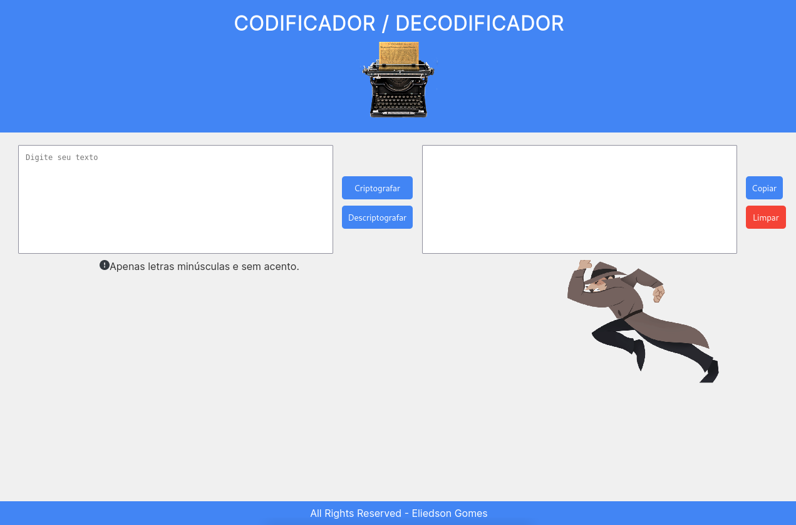

# CODIFICADOR / DECODIFICADOR DE TEXTO



## Acesse o projeto clicando <a href="https://eliedson1979.github.io/criptografo-texto/">AQUI</a>

<br />

## 📡 Desenvolvimento

Projeto desenvolvido na <a href="https://Alura.com/" target="_blank">Alura</a> durante o Challenge ONE Iniciante em Programação.

Nesse projeto desenvolvemos uma aplicação para encriptografar e descriptografar texto. Colocamos em prática o aprendizado em HTML5 | CSS | Formulários | Responsividade | Flex-Box | Media Queries | Estilização | JavaScript | DOM | Funções | 

<br />

## 🚀 Instalação e execução

  <details>
    <summary>Instalando e executando</summary>
    <br />

### 1 - Clone o repositório:

```
git clone git@github.com:Eliedson1979/criptografo-texto.git
```

### 2 - Acesse a aplicação:

Abrindo a pagina index.html usa: <(http://127.0.0.1:5500/index.html)> em seu navegador.

  </details>
<br />

## ⚙️ Tecnologias

* HTML5
* CSS
* JavaScript
* DOM

